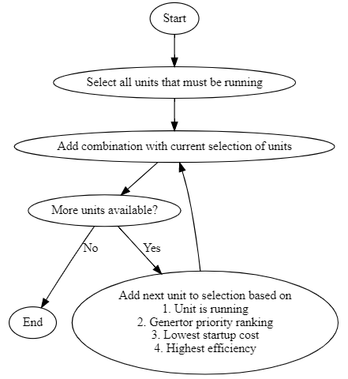
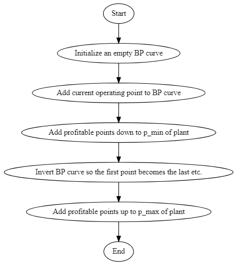
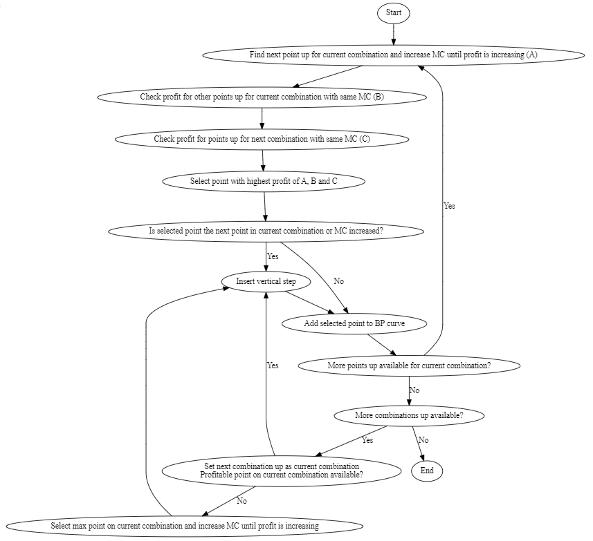
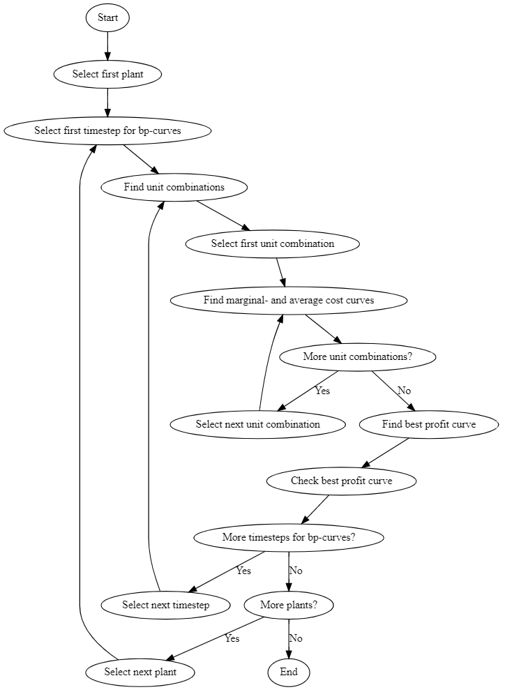

---
jupytext:
  text_representation:
    extension: .md
    format_name: myst
    format_version: 0.13
    jupytext_version: 1.13.8
kernelspec:
  display_name: Python 3
  language: python
  name: python3
---

(best-profit)=
# Best Profit

## Theory

The Best Profit (BP) functionality is designed for decision support in markets with frequent deadlines and short activation times, for instance the Nordic mFRR activation market. It is based on the assumption of perfect competition, which means that a single market participant does not influence the price. To derive the optimal strategy, we define the market revenue $R$ as

$$ R=\pi p-c(p)\tag{1}$$

where $\pi$ is the market price, $p$ is the production and $c(p)$ is the cost for producing at level $p$. To maximize the revenue, we differentiate $R$ with respect to $p$, set equal to zero, and obtain

$$ \pi = \frac{\partial c(p)}{\partial p} \tag{2}$$

Marginal cost (MC) is defined as the difference in production cost at two levels divided by the difference in production $\Delta p$.

$$ MC=\lim_{\Delta p \to 0}\frac{c(p_0+\Delta p)-c(p_0)}{\Delta p} =  \frac{\partial c(p)}{\partial p} \tag{3}$$

The right hand side of equation (2) and (3) are equal, thus we can conclude that the optimal strategy for a profit-seeking price-taker in a perfect market is to bid its marginal cost. 

$$ \pi = MC \tag{4}$$

In addition, the producer is not obliged to participate in the market if there is no profit. In order to have a profit, the requirement is to at least get coverage for the production cost. We define the average cost (AC) in equation (5) below.

$$ AC=\frac{c(p)}{p} \tag{5}$$

Since optimal pricing means that $\pi = MC$, the requirement for positive profit is that the cost per unit (AC) must be smaller than the income per unit (MC). This condition is summarized below in equation (6).

$$ AC < MC \tag{6}$$

+++

## Implementation

Based on the theoretical discussion above, it is clear that an important part of the BP-functionality is to create MC- and AC-curves for relevant combinations of units in each plant. Criteria based on both availability and efficiency are used in this process, as shown in the flowchart for unit combination selection below.

+++

+++

After finding the relevant unit combinations, the MC- and AC-curves are created independently for each timestep by using the following elements.

- Static model data for the watercourse
- Reservoir levels at the start of the timestep
- Water values
- Feed-in fees

The costs faced by hydropower producers also include costs that are not direct functions of production, such as start/stop-costs. These are taken into account in the second part, when BP-curves are created on plant level. In addition, capacity reserved for obligations in other markets are included. Finally, the requirement from the market is that the bid curve is monotonous, which means non-decreasing production for increasing price levels. The algorithm for generating BP-curves from MC- and AC-curves is showed in the flowchart below.

+++

+++

The steps inside "Add profitable points down" and "Add profitable points up" are further detailed in the flowcharts below. The steps for finding points down are shown in the first flowchart, and the steps for finding points up are shown in the second flowchart.

+++

+++

+++

The BP-curves are created from a relatively complex set of heuristics, and results may be used directly for bidding in the market. As an extra safety measure, all BP-curves are run through a set of consistency checks when they have been created. A prerequisite in the definition of BP-curves is that they must have non-decreasing profit when moving to any new production level $p_{new}$ from the current operating point $p_{op}$. This regulation profit (RP) is defined in the equation below.

$$ RP = MC_{new}(p_{new} - p_{op}) - (AC_{new}p_{new}-AC_{op}p_{op}) - c_{startup} - c_{shutdown} \tag{7}$$

The following checks are performed.

- The BP-curve must have at least one point
- All plant production levels must be real numbers
- All generator production levels must be real numbers
- All marginal costs must be real numbers
- All average costs must be real numbers
- All points must have larger or equal production compared to the previous point
- All points must have larger or equal marginal cost compared to the previous point
- All points must have same reference production level for AC and MC
- The sum of generator production must equal the plant production for all points
- The regulation profit must be non-negative from the current operating point to all other points

If any of these checks fail, a warning is written to the SHOP-log.

We have now defined the components that constitute the BP-functionality. The flowchart below shows the complete workflow.

+++

+++

## Usage

+++

The BP-functionality is activated by the command

    print bp_curves <starttime> <endtime>

Starttime and endtime are given as the number of **hours** from the start of the optimization horizon, regardless of the time resolution of SHOP. To define the operating point for each hour, the **ref_prod** attribute must be set on each generator. If a generator has a production schedule, it will be fixed to that production in the BP-curve as well.

The results are accessible both in the API and written to one XML-file per plant.
